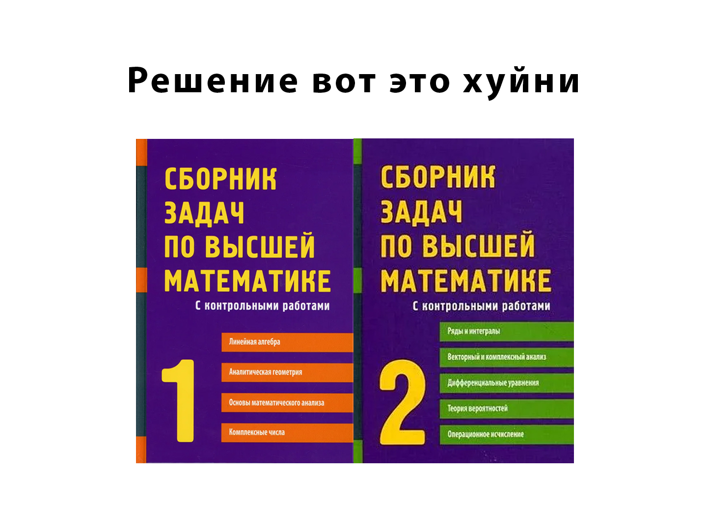

# Math_Lungu

Решение сборника задач по высшей математике от К.Н. Лунгу в двух частях.

---

---

## Навигация

### Часть 1

#### Глава 1. Матрицы и определители

1) Операции над матрицами
2) Определители
3) Ранг матрицы
4) Обратная матрица. Матричные уравнения

#### Глава 2. Системы линейных уравнений

1) Исследование систем линейных уравнений. Теорема Кронекера-Капелли. Метод Гаусса.
2) Решение система линейных уравнений с помощью обратной матрицы. Формулы Крамера
3) Однородные и неоднородные системы линейных уравнений

#### Глава 3. Векторная алгебра

1) Векторы. Линейные операции над ними. Разложение векторов
2) Скалярное произведение векторов
3) Векторное произведение векторов
4) Смешанное произведение векторов

#### Глава 4. Аналитическая геометрия на плоскости

1) Метод координат на плоскости
2) Прямая на плоскости
3) Кривые второго порядка

#### Глава 5. Аналитическая геометрия в пространстве

1) Метод координат в пространстве
2) Плоскость в пространстве
3) Прямая в пространстве
4) Прямая и плоскость в пространстве
5) Поверхности второго порядка

#### Глава 6. Функции и пределы

1) Функции и их графики
2) Последовательности и их свойства
3) Предел последовательности
4) Предел функции
5) Непрерывность функции

#### Глава 7. Производная и ее применение

1) Производная функции
2) Дифференциал
3) Теоремы о среднем. Правила Лопиталя. Формулы Тейлора
4) Исследование функций и построение графиков

#### Глава 8. Неопределенный интеграл

1) Важнейшие свойства интегрирования
2) Основные методы интегрирования
3) Интегрирование рациональных дробей
4) Интегрирование иррациональных функций
5) Интегрирование тригонометрических функций

#### Глава 9. Определенный интеграл

1) Приемы вычисления
2) Несобственные интегралы
3) Приложения определенного интеграла

#### Глава 10. Комплексные числа

1) Комплексные числа, основные понятия. Геометрическое изображение комплексных чисел. Формы записи комплексных чисел
2) Действия над комплексными числами

#### Глава 11. Функции нескольких переменных

1) Понятие функции нескольких переменных. График и линии уровня функции двух переменных
2) Предел функции в точке. Непрерывность функции в точке и на множестве
3) Частные производные. Полный дифференциал. Линеаризация функций.
4) Дифференциоравание сложных и неявных функций. Касательная и нормаль к поверхности
5) Частные производные и дифференциалы высших порядков
6) Производная по направлению. Градиент
7) Экстремум функции двух переменных
